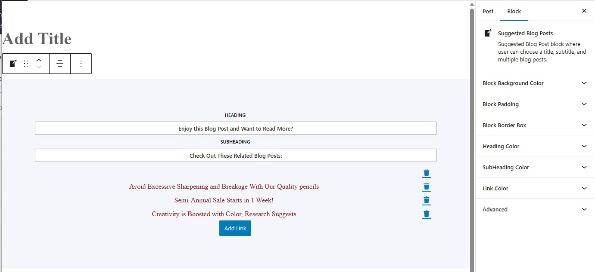
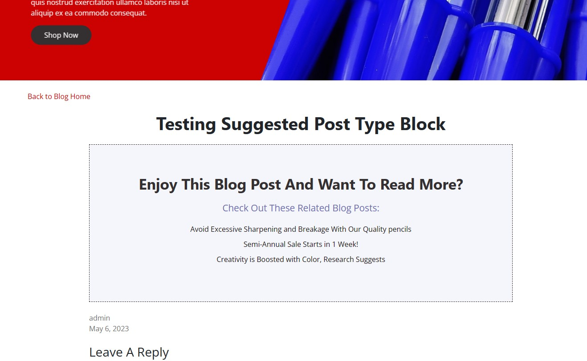

# Suggested Blog Posts WordPress Block Plugin

A WordPress block plugin that enables users to add a block to their page/post content in the gutenberg block editor. The block displays a box which contains a title, subtitle, and any number of links to other suggested reading content. The link functionality works with the __experimentalLinkControl component of the @wordpress/block-editor module, which allows the user to type in a search term to find related posts on the website. The plugin also includes support for the user to select the alignment of the text (center, right, or left) from the hover toolbar and the block background color, block padding, block border, font color (of the title, subtitle, and links) from the right sidebar in the block editor. Build with CSS, PHP, JavaScript, WP's version of React from the @wordpress/element module, and multiple other modules, including @wordpress/components, @wordpress/block-editor, and @wordpress/i18n.
 
## Project Screen Shot(s)

Suggested Blog Posts Block Plugin

The Suggested Blog Posts Block Plugin is available under the Widgets heading of the Gutenberg Block selector.

Alignment Options

The Suggested Blog Posts Block Plugin allows the user to select the overall alignment of all the text inside the block. The options include left, center, and right. These options are presented in the hover toolbar.

Link Search Functionality

The __experimentalLinkControl component allows the user to type in a URL or a search term. If a search term is provided, results from the website's  posts will be shown for the user to select from.

Any Number of Links May Be Selected

The user is free to add as many links as needed to the block.

Right Sidebar Options

In the right sidebar there are options for Block Background Color, Block Padding, Block Border Box, Heading Color, SubHeading Color, and Link Color.

Live Changes

As the user makes changes to features in the right sidebar, the updates show up in the block. In this example, the user has changed the background color, and the block has reflected this change.

The Options Explained

, border type (solid, dashed, or dotted), and the size.")

The Block Background Color, Heading Color, Subheading Color, and Link Color options display a color palette for the user to select from. The Block Padding option displays a drop-down menu for the user to select from a list of options for sizing. The Block Border Box option allows the user to select the color (from a color palette), border type (solid, dashed, or dotted), and the size.

The Front-End

All of the changes the user selected and published will render on the front-end.

## Installation

1. Upload the plugin files to the `/wp-content/plugins/(new folder for the plugin)` directory, or install the plugin through the WordPress plugins screen directly.
2. Activate the plugin through the 'Plugins' screen in WordPress
The plugin should now be available in the block editor, under the Widgets section.

## Reflection

I built this project while studying WordPress custom block plugins. It relies heavily on the @wordpress/components and @wordpress/block-editor modules for adding functionality to the hover toolbar and right sidebar in the block editor.

## References

- Block boilerplate created with @wordpress/create-block
- Udemy - Brad Schiff - Become a WordPress Developer: Unlocking Power With Code - https://www.udemy.com/course/become-a-wordpress-developer-php-javascript/ 